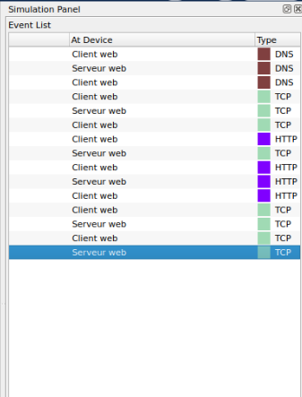
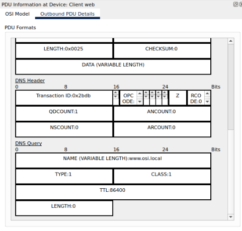

# COMPTE RENDU
# PARTIE 1: *3 Exploration du contenu du paquet HTTP*
## 3.
### **a) Quelles sont les informations qui figurent dans la partie basse de cette fenêtre ?(« Zone d’information » ci-dessus)**
_les informations sont : "1. The HTTP client sends a HTTP request to the server."_

### **b) Quelle est la valeur Dst Port pour la couche 4 dans la colonne Out Layers ?**
_Valeur Dst Port pour couche 4 : 80_

### c) **Quelle est la valeur Dest. IP pour la couche 3 ?**
_la valeur Dest. IP est "192.168.1.254"_

### d) **Quelles sont les informations affichées au niveau de la couche 2** 
_les informations sont :_

## 4.
### a) **Quelles sont les informations répertoriées à la fois dans la section IP de PDU Details (Détails PDU) et dans l'onglet OSI Model (Modèle OSI) ?**
_Les informations a la fois présente dans la section IP par rapport à l'onglet OSI Model sont la "SRC IP" et la "DST IP" ainsi que leurs valeurs respectives._
add points-commun img2 et img4

### **À quelle couche ces informations sont-elles associées ?**
_ces informations sont associées à la couche 3._

### b) **Quelles sont les informations communes énumérées dans la section TCP par rapport à l'onglet OSI Model et à quelle couche sont-elles associées ?**
_Les informations a la fois présente dans la section TCP par rapport à l'onglet OSI Model sont la "SOURCE PORT" et "DESTINATION PORT" ainsi que leurs valeurs respectives._

### c) **Quel est l'hôte figurant dans la section HTTP ?**
_l'hôte est HTTP REQUEST_

#### **À quelle couche ces informations sont-elles associées ?**
_ces informations sont associées à la couche 7_

## 5. 
### **Cliquer sur le carré coloré suivant.Seule la couche 1 est active (non grisée). Le périphérique prend la trame dans la mémoire tampon et la place sur le réseau.**

## 6. 
### **Passer à l’étape suivante ; cette fenêtre contient à la fois In Layers (Couches en entrée) et Out Layers (Couches en sortie).**

## 7.
### a) **En comparant les informations affichées dans la colonne In Layers avec celles de la colonne Out Layers, quelles sont les principales différences ?** 
_Les principales différences sont que les informations affichées dans la colonne In Layers sont presque l'opposé de celles présente dan la colonne Out Layers. EX : Dans la couche 1 -> "FastEthernet0 receives the frame." et a l'extérieur de la couche 1 -> "FastEthernet0 sends out the frame."_

## 8.
### **Cliquer sur l'onglet Inbound et Outbound PDU Details. Vérifier les détails des trames échangées (aussi appelées PDU ou paquets IP)**

## 9.
### **Cliquer sur la dernière case : combien d’onglets sont affichés pour cet événement ? Expliquer pourquoi !**
_Seulement 2 onglets sont afficher car le client Web ne fait que reçevoir des informations de confirmations de son 1er envoie et ne renvoie rien._

## 2.
### **a) Quels types d'événements supplémentaires sont affichés ?**
_Ici, il y a 15 évènements dans se cas présent avec en plus des types HTTP, la présence de type TCP et DNS_

### **b) Quels sont leurs rôles au sein de la suite TCP/IP ?**
_Le TCP a pour rôle de livrer les données tandis que le DNS a pour rôle dans l’identification des hôtes distants en renommant les adresses IP notamment._

## 3.
### **Cliquer sur le premier événement DNS dans la colonne Type. Examiner les onglets OSI Model (Modèle OSI) et PDU Detail (Détails PDU), et observer le processus d'encapsulation. La zone d’information fournit des explications sur ce qui se produit durant le processus de communication.**
_Au niveau de la couche 4, la machine encapsule le PDU en un segment UDP tandis que dans la couche 2, la machine encapsule le PDU en Ethernet._

## 4.
### **Cliquer sur l'onglet Outbound PDU Details : quelles informations figurent dans le champ NAME: dans la section DNS Query ?**
_Dans la section DNS Query, le nom affiché est l’URL rentré précedemment soit : www.osi.local_

## 5. 
### **a) A quel périphérique la PDU a-t-elle été capturée ?**
_Le PDU a été capturée par le client web._
 ### **b) Quelle est la valeur indiquée en regard de la zone ADDRESS : de la section DNS Answer ?**
_La valeur indique dans DNS Answer est : 192.168.1.254_

## 6.
### **a) Dans l’onglet OSI Model, qu’indiquent les étapes 4 et 5, affichées dans la zone d’information pour la couche 4 ?**
_Dans la couche 4, l’étape 4 nous indique que la connexion au TCP a été un succès. Puis l’étape 5 indique que la machine à régler l’état de connexion sur établie._

### **b) Même question pour le dernier événement TCP dans la liste.**
_Dans la couche 4, l’étape 4 nous indique que la machine à rélger l’état de connexion à clos._
